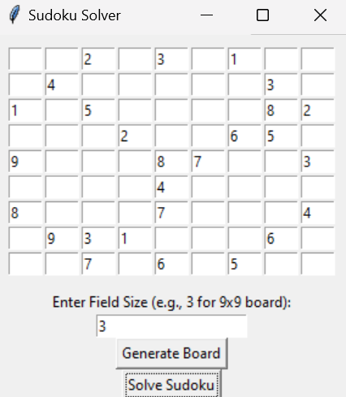
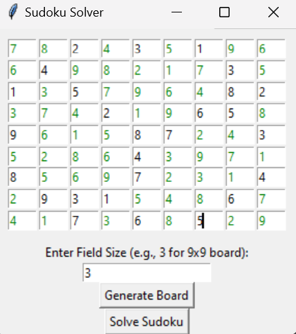

# Prolog Sudoku solver

## Introduction
This is my implementation of a Sudoku solver in Prolog. It is the semestr-project of the course "Non-procedural programming" at the Charles University in Prague.

This sudoku solver is size-independant, therefore some larger and crazier boards can be solved with it.

Since developing a GUI in prolog is very difficult and beyond the scope of our knowledge from the semester course, it is created in python TKInter and the communication between python and prolog is created via two (input and output) files.

## Usage
The solver is implemented in the file `sudoku.pl`. To run it, you need to have SWI-Prolog installed. Then you can run the solver by typing `swipl sudoku.pl` in the terminal. The solver is automatically invoked in `main` with `sudoku/2`. The arguments are:
- Size of the sudoku grid. (Square root of the length of a whole row or size of the single subsquare) (traditional sudoku would therefore be invoked like: `sudoku(3, [[..]..])`)
- List of rows of the Sudoku grid. Each row is a list of integers. The empty cells are represented by '_'.

Both arguments are in the `input_sudoku.pl` within two predicates:
- `size(X)`
- `board(X)`

`input_sudoku.pl` is automatically created with python app after entering board size, all necessary numbers in the board and clicking "Solve Sudoku".

If there is a solution to the problem, it will be printed green into the given problem. Otherwise nothing will be filled.

## Example

Inserting problem

  

Solution to the problem

  

## Implementation

### Prolog

Basic idea is to call predicate `all_different/1` on all rows, columns and subsquares.

The most tricky part is to obtain all subsquares based on the size of the grid -> when having 9x9 grid, there are 9 3x3 subsquares, which also must contain all different numbers. This is done by predicate `squares/3`, `xSquares/4` and `xySquares/5` respectively. 

Predicate `squares/3` returns a list of all squares from the grid. Predicate `xSquares/4` returns a list of all squares from the grid, but only those, which are in the same row as the given cell. Predicate `xySquares/5` returns one single square by the given X and Y coordinates.

The starting indices of each square are determined by the predicate `multiples/2`, which for the given board size (for example 3) returns all multiples of the number in the range of the size of the board (aka: 0, 3 and 6).

There is also an input check that every row has the same length as the size of the grid, same that every column has the same length as the size of the grid. This check is inserted into the main predicate `sudoku/2`.

### Python

Since python application is not core of this project, the TKInter interface is not built sofistically. It only serves as a argument parser.
First it loads the field size from the user, then creates a board with the given size and lastly generates the corresponding input file.

Worth mentioning is the number range check. If user tries to add a number which is greater than the maximal range (e.g. for 9x9 board anything outside range <1, 9>) the number will be highlighted red.